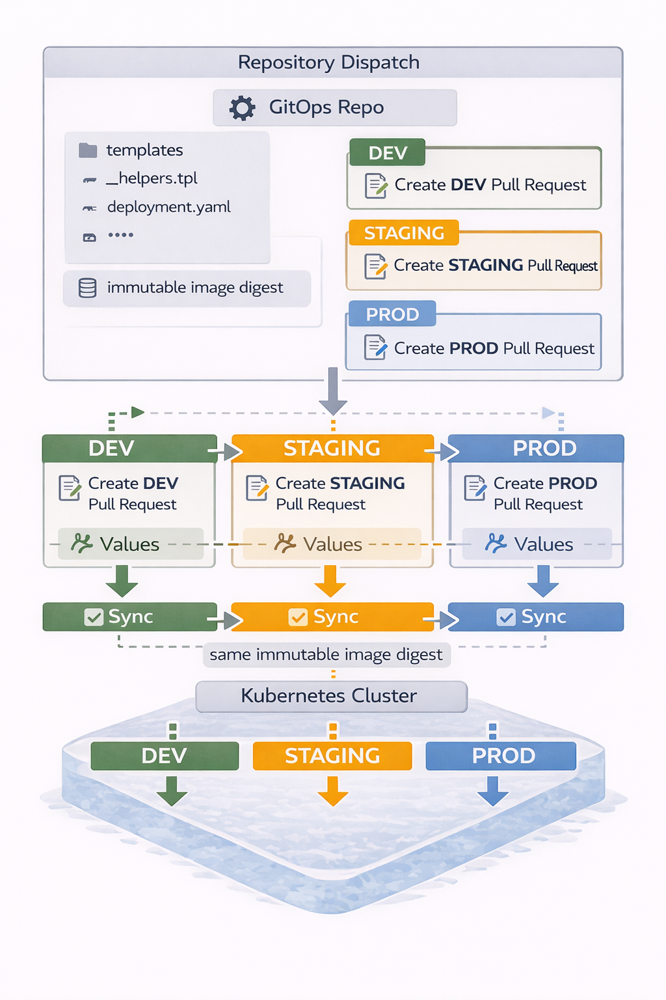
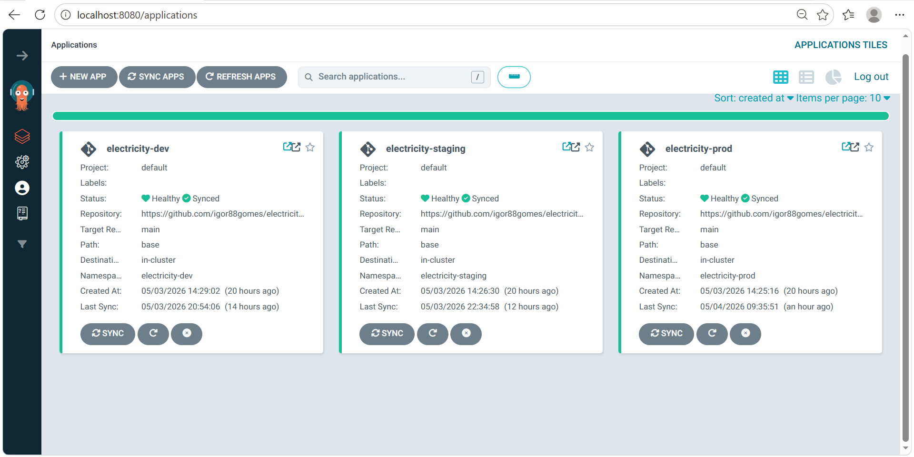
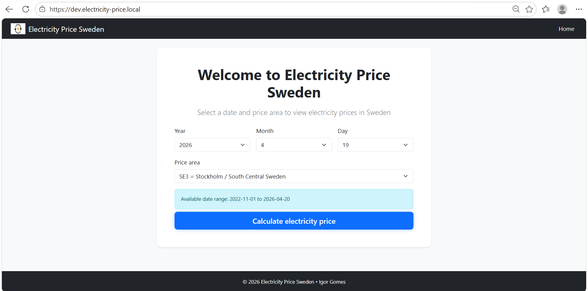
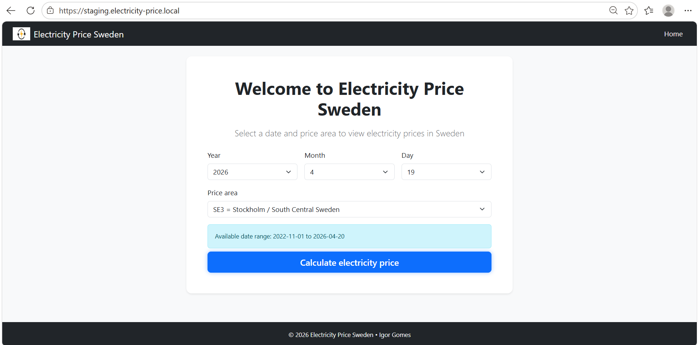
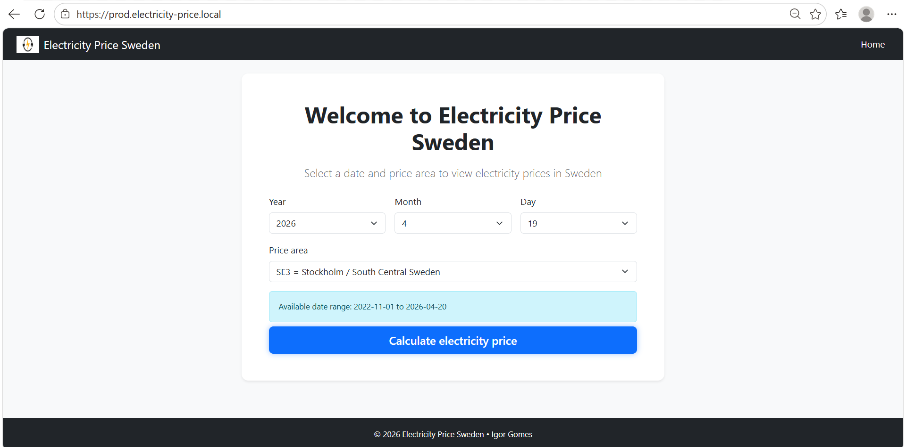
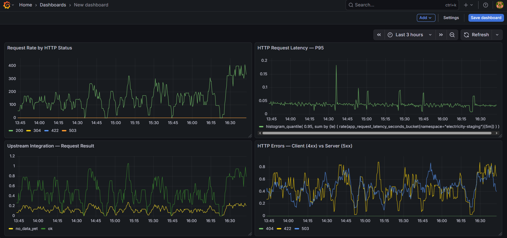
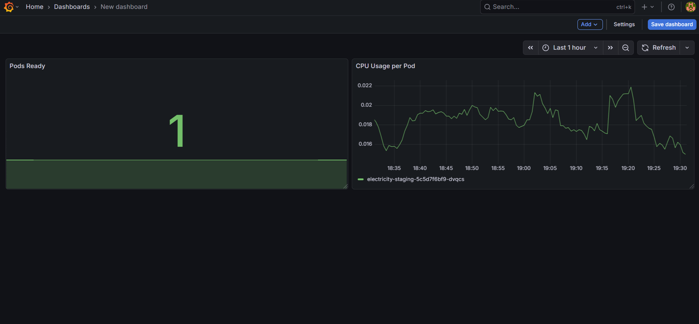
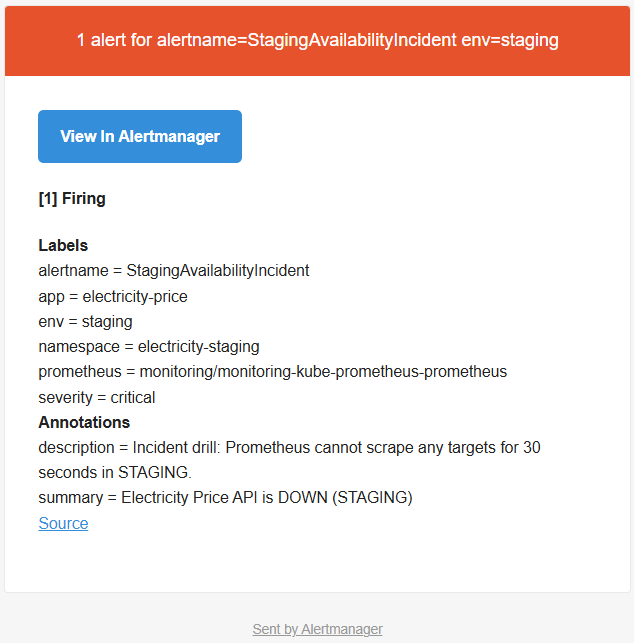
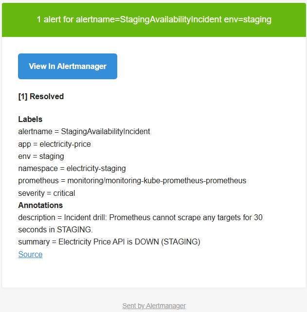

[](https://github.com/igor88gomes/electricity-price-gitops/actions/workflows/gitops-validation.yaml)
[](https://github.com/igor88gomes/electricity-price-gitops/actions/workflows/update-dev.yaml)
[](https://github.com/igor88gomes/electricity-price-gitops/actions/workflows/promotion-handler.yaml)
[](https://github.com/igor88gomes/electricity-price-gitops/actions/workflows/prod-release-handler.yaml)
[](https://github.com/igor88gomes/electricity-price-gitops/actions/workflows/secret-scan.yaml)

> Av Igor Gomes 

# Electricity Price Sweden — GitOps Repository

> GitOps repository som styr deployment av *Electricity-Price*-applikationen genom Helm + Argo CD. Detta repository arbetar tillsammans med **electricity-price** (application repository), som ansvarar för CI och artifact-CD, medan **electricity-price-gitops** ansvarar för deployment-CD till Kubernetes-klustret.

---

<p align="center">
  
  <br>
  <em>Övergripande flöde för applikation och GitOps-leverans.</em>
</p>

## Projektöversikt

### Vad
> GitOps-repository som definierar önskat tillstånd för deployment och miljö-promotion av
> Electricity Price-applikationen i Kubernetes via Helm, vilket synkroniseras och appliceras
> av Argo CD.

### Varför
> För att separera applikationsutveckling (CI och artifact delivery) från deployment och
> runtime-konfiguration i ett kontrollerat leveransflöde.

### Värde
> Möjliggör verifiering i drift av färdigbyggda container-artefakter i flera miljöer.

> Samma artefakt kan promouteras vidare utan rebuild via deklarativ konfiguration som
> kontinuerligt synkroniseras mot klustret. 

> Lösningen innehåller delar som observability, alerting, policyvalidering
> och en definierad rollback-strategi vid incidenthantering.

### Avgränsningar
> Detta repo ansvarar inte för provisioning av Kubernetes-kluster, nätverk eller
> cloud-resurser. Ett existerande kluster förutsätts.

## Förutsättningar och kontext

Detta GitOps-repository är utformat för att användas i en Kubernetes-baserad miljö där deployment och miljö-promotion hanteras deklarativt via GitOps-principer.

Lösningen förutsätter ett befintligt Kubernetes-kluster (t.ex. Minikube, OpenShift eller ett molnbaserat Kubernetes-kluster), där klustret och underliggande infrastruktur hanteras utanför detta repository och inte ingår i dess ansvarsområde.

Lösningen utgår från följande tekniska val:

- **Argo CD** används som GitOps-motor för att rendera Helm-manifester och applicera förändringar i klustret.

- Applikationen deployas via ett **Helm chart (Helm v3)**, där samma chart används i DEV, STAGING och PROD med miljöspecifika `values.yaml`.

- Observability och alerting bygger på en Prometheus Operator-baserad stack. Funktioner som **ServiceMonitor** och   **PrometheusRule** används där sådan infrastruktur finns tillgänglig.

### Arkitekturellt val

I denna lösning körs DEV, STAGING och PROD i separata namespaces inom samma Kubernetes-kluster.

Detta ger logisk separation av resurser, konfiguration och deployment-flöden, samtidigt som gemensam plattformsinfrastruktur och klusterresurser delas.

Valet är medvetet och möjliggör en reproducerbar och resurseffektiv demonstration av GitOps-flödet, med tydlig miljöuppdelning på applikations- och konfigurationsnivå.

---

## Teknikstack

| Komponent                     | Info                                                       |
|-------------------------------|------------------------------------------------------------|
| **Argo CD**                   | GitOps-deployment och automatiska syncs                    |
| **Helm**                      | Templating av Kubernetes-manifester                        |
| **Kubernetes**                | Deployment i DEV / STAGING / PROD-miljöer                  |
| **GHCR**                      | Container registry för applikations-images                 |
|**kube-prometheus-stack**      | Installerar Prometheus, Grafana, Alertmanager              |
| **ServiceMonitor (CRD)**      | Kopplar appens `/metrics` till Prometheus-scraping         |
| **Ingress Controller**        | NGINX ingress-lösning                                      |
| **Policy-as-Code (OPA/Rego)** | Säkerhets- och compliance-regler för Kubernetes-manifester |
| **GitHub Actions**            | Automation för GitOps-promotion, validering och governance |
| **Gitleaks**                  | Secret scanning av manifests och values                    |

> Projektet är demonstrerat med ett Kubernetes-kluster baserat på Minikube.

## Helhetsarkitektur 

> Promotioner initieras av application-repositoryt via `repository_dispatch`. GitOps-repositoryt reagerar på `repository_dispatch`-events från application-repositoryt genom att skapa Pull Requests per miljö, vilka efter merge appliceras av Argo CD.

```text
APP-repository
(CI: tester, lint, security scanning, build)
    ↓
Artifact-CD: Docker Publish
(skapa en enda immutable digest)
    ↓
repository_dispatch (promotion event)
    ↓
GitOps-repository
    ↓ PR till DEV
      → Merge → Argo CD → Kluster → electricity-dev
    ↓ PR till STAGING
      → Merge → Argo CD → Kluster → electricity-staging
    ↓ PR till PROD
      → Merge → Argo CD → Kluster → electricity-prod
```

### Viktigt  

- Image-digest byggs **en gång** i application-repositoryt och används som ett immutable container-artifact.
- GitOps-repositoryt ansvarar enbart för promotion och deployment av befintliga artifacts.
- Promotion mellan miljöer sker via Pull Requests för full spårbarhet och återanvänder samma image-digest (ingen rebuild).
 
---

## GitHub Actions – Pipelines i detta repository

Detta GitOps-repository använder GitHub Actions för att hantera både **deployment/promotion** och **kvalitet, säkerhet och governance** i GitOps-flödet.

Pipelines är uppdelade i två tydliga kategorier:

### CD – GitOps Promotion & Deployment Pipelines

#### `update-dev.yaml`
- Skapar PR till DEV-values som refererar och pinnar det senast publicerade image-digestet i container-registret (byggt i application-repositoryt)
- Vid merge: Argo CD sync → DEV-klustret

#### `promotion-handler.yaml`
- Skapar PR till STAGING-values som refererar och pinnar det image-digest som är deployat i DEV
- Vid merge: Argo CD sync → STAGING-klustret

#### `prod-release-handler.yaml`
- Skapar PR till PROD-values som sätter release-tag (SemVer) och pinnar samma image-digest som har promouterats genom DEV och STAGING 
- Vid merge: Argo CD sync → PROD-klustret

### Kvalitet & Säkerhetspipelines

Utöver pipelines för miljö-promotion och deployment innehåller detta repository även pipelines för **validering, säkerhet och governance**. Dessa säkerställer att endast korrekta och säkra förändringar kan mergas och appliceras via GitOps.

#### `gitops-validation.yaml`
Körs vid Pull Requests för att:
- Validera YAML-syntax
- Säkerställa korrekt struktur i Helm-manifester
- Validera Policy-as-Code (OPA/Rego) för att säkerställa att applikationens manifests uppfyller plattforms- och säkerhetskrav (t.ex. TLS, resursgränser, non-root)

> Förhindrar att Argo CD synkar trasiga eller ogiltiga manifests till klustret.

#### `secret-scan.yaml`
Dedikerad pipeline för **secret scanning** i GitOps-repot:
- Kör Gitleaks med anpassad konfiguration
- Identifierar potentiella credentials och hemligheter
- Failar workflow vid upptäckt av secrets

> Skyddar GitOps-repositoryt från att oavsiktligt innehålla känslig information. (Supply-chain- och artifact-security hanteras i application-repositoryt.)

---

## Argo CD Integration

Argo CD används för att applicera och synkronisera GitOps-konfigurationen till Kubernetes-klustret.

Varje miljö representeras som en separat Argo CD-applikation och deployas till ett eget namespace:

- `electricity-dev`
- `electricity-staging`
- `electricity-prod`

<p align="center">
  
  <br>
  <em>Argo CD-applikationer för DEV, STAGING och PROD.</em>
</p>

## Helm-rendering och deklarativ deployment

Applikationen deployas via ett Helm-chart där Argo CD renderar manifests utifrån ett gemensamt chart (`base/`) i kombination med miljöspecifika values-filer.

Deployment-flödet är helt deklarativt och följer GitOps-principer.

### Helm Chart – Resurser och funktioner

| Resurs         | Funktion                                                        |
|----------------|-----------------------------------------------------------------|
| Deployment     | Kör applikationscontainern med liveness- och readiness-probes   |
| Service        | Exponerar applikationen internt i klustret (ClusterIP)          |
| Ingress        | Exponerar applikationen externt per miljö                       |
| ServiceMonitor | Aktiverar Prometheus-scraping av `/metrics`                     |
| PrometheusRule | Definierar applikationsspecifika alerts                         |
| NetworkPolicy  | Begränsar nätverkstrafik till och från applikationen            |
| Helm helpers   | Gemensam namngivning, labels och annotations via `_helpers.tpl` |

###  Miljöer

| Miljö       | Funktion                         | URL                               |
|-------------|----------------------------------|-----------------------------------|
| DEV         | Första test                      | `dev.electricity-price.local`     |
| STAGING     | Pre‑prod                         | `staging.electricity-price.local` |
| PROD        | Live‑miljö                       | `prod.electricity-price.local`    |


## Applikation i drift i Kubernetes (DEV / STAGING / PROD)

> Applikationen körs i Kubernetes och är aktiv i tre separata miljöer (DEV, STAGING och PROD), var och en i ett eget namespace, med trafik hanterad via miljöspecifika Ingress-resurser, som ett resultat av GitOps-styrt flöde.


<p align="center">
  
  <br>
  <em>DEV-miljö: applikationen körs i Kubernetes i namespace <code>electricity-dev</code>, deployad via GitOps-flöde.</em>
</p>

<p align="center">
  
  <br>
  <em>STAGING-miljö: applikationen körs i Kubernetes i namespace <code>electricity-staging</code>, deployad via GitOps-flöde.</em>
</p>

<p align="center">
  
  <br>
  <em>PROD-miljö: applikationen körs i Kubernetes i namespace <code>electricity-prod</code>, deployad via GitOps-flöde.</em>
</p>

---

## Rollback Guide (Production Incident)

### Steg 1 — Identifiera vilket image-digest som körs i PROD

- I **Argo CD**: öppna PROD-applikationen och notera det aktuella image-digestet

### Steg 2 — Identifiera ett stabilt Release (tag + image-digest)

- I **application-repositoryt**: identifiera senaste fungerande **Release (SemVer-tag)**
- I container-registret (GHCR): kopiera **image-digestet** som hör till den releasen

> Releases representerar versioner (SemVer-tag) som har passerat hela flödet `DEV → STAGING → PROD` och betraktas som stabila.

### Steg 3 — Uppdatera PROD-miljön

I **GitOps-repositoryt**, uppdatera PROD-miljön genom att sätta det stabila image-digestet i  `environments/prod/values.yaml`:

```yaml
image:
  digest: sha256:<stabilt-digest>
```

Commit → PR → Merge → Argo CD sync (ingen rebuild).

**PROD återställs direkt.**  
Detta är ett snabbt och kontrollerat sätt att stabilisera produktionen inom detta GitOps-flöde.

> **Notera:**  
> Detta rollback återställer ett tidigare stabilt tillstånd.  
> Permanenta åtgärder kräver kodändringar och en ny image-build i application-repositoryt.

---

## Observability & Alerting

> Alla exempel för observability och larmning demonstreras i STAGING-miljön, som används för validering inför promotion till PROD.

Denna setup är baserad på *kube-prometheus-stack* med Prometheus, Grafana och Alertmanager som centrala komponenter.

Fokus ligger på ett GitOps-styrt Kubernetes-flöde, med ett avgränsat och medvetet scope.

Uppdelningen sker mellan:

- **Application-level observability**
- **Kubernetes / platform-level observability**

### Observability-pipeline

```text
Application / Kubernetes
        ↓
Metrics / Signals
        ↓
   Prometheus 
   ↓        ↓
Grafana  Alertmanager

```
### Prometheus – Metrics & Monitoring

Applikationen exponerar `/metrics` och skrapas av Prometheus via en ServiceMonitor som ingår i Helm-chartet.
Detta möjliggör:
- Övervakning av applikationens hälsa och prestanda
- Metrics som används för visualisering i Grafana
- Underlag för alerting via PrometheusRule och Alertmanager

### Observability-strategi

| Miljö       | Observability-scope                               |
|-------------|---------------------------------------------------|
| **DEV**     | Platform-level observability (Kubernetes runtime) |
| **STAGING** | Application-level + platform-level observability  |
| **PROD**    | Application-level + platform-level observability  |

### Applikationsobservability (STAGING)

Dashboarden fokuserar på **Golden Signals** och applikationshälsa:

- Request rate per HTTP-status
- P95-latens för HTTP-requests
- Upstream-integrationens resultat
- Fördelning mellan klientfel (4xx) och serverfel (5xx)

<p align="center">
  
  <br>
  <em>
    Grafana-dashboard för applikationsobservability i STAGING-miljö.
  </em>
</p>

### Kubernetes Runtime Observability (STAGING)

Denna dashboard fokuserar på **platform-level observability** och visar hur Kubernetes-plattformen
stödjer applikationen.

Fokus ligger på **resursstatus och tillgänglighet**, oberoende av applikationens egna metrics:

- Antal **Pods Ready** i `electricity-staging`
- **CPU-användning per pod** över tid
- Underlag för att bedöma stabilitet och resursbeteende

<p align="center">
  
  <br>
  <em>
    Grafana-dashboard för plattformsobservability
    (namespace: electricity-staging).
  </em>
</p>

---

### Alerting-strategi

Alerting definieras deklarativt via **PrometheusRule** och hanteras av **Alertmanager** som en del av *kube-prometheus-stack*.

Strategin fokuserar på att upptäcka **kritiska tillstånd** som påverkar applikationens tillgänglighet och stabilitet, oavsett om orsaken ligger i
**applikationsbeteende** eller **Kubernetes-runtime**.

Exempel på kritiska tillstånd som övervakas:

- applikationen kan inte skrapas av Prometheus
- förhöjd andel **HTTP 5xx**
- onormala latensnivåer (P95)
- instabila eller återstartande pods

Alerting är aktiverat i **STAGING** för validering av regler och notifieringar samt i **PROD** för faktisk incidenthantering i live-miljö.

#### Alertmanager – notifieringar

Alertmanager är konfigurerad för att skicka notifieringar via **e-post (SMTP-baserad notifiering)**. Notifieringslogiken definieras genom en dedikerad `AlertmanagerConfig`-resurs, med autentiseringsuppgifter lagrade säkert i Kubernetes **Secrets**.

`AlertmanagerConfig` hålls medvetet utanför GitOps-repositoryt eftersom den innehåller miljö- och säkerhetskänslig runtime-konfiguration. Resursen appliceras därför direkt i klustret och versioneras inte i Git.

Notifieringar skickas för både:

- **FIRING** (incident upptäckt)
- **RESOLVED** (incident åtgärdad)

#### E2E-validering av alerting (STAGING)

Alerting har verifierats end-to-end genom ett kontrollerat tillgänglighetstest, vilket verifierade korrekt hantering av både  **FIRING** och **RESOLVED**.

<p align="center">
  
  <br>
  <em>
    Alertmanager-notifiering när Electricity Price-applikationen inte längre
    kan skrapas av Prometheus.
  </em>
</p>

<p align="center">
  
  <br>
  <em>
    Alertmanager-notifiering när applikationen åter är tillgänglig och minst
    en scrape-target är frisk.
  </em>
</p>

## Relaterade repositories

**Application Repository:**  
https://github.com/igor88gomes/electricity-price

## Repository‑struktur

```text
electricity-price-gitops/
├── .github/workflows/      # GitHub Actions för GitOps-promotion, validering och säkerhet
├── argo/                   # Argo CD Application-manifests för DEV, STAGING och PROD
├── base/                   # Helm chart som definierar applikationens Kubernetes-resurser
├── environments/           # Miljöspecifika Helm values (DEV, STAGING, PROD)
├── policy/                 # Policy-as-Code (OPA/Rego) för validering av Kubernetes-manifester
├── docs/                   # Dokumentation och bilder som används i README
├── .gitignore              # Ignorerade filer och kataloger
├── .gitleaks.toml          # Regler för secret scanning (Gitleaks)
├── .yamllint               # YAML-lintingregler för manifests
└── README.md               # Projektöversikt, arkitektur, GitOps-flöde och observability

```
---

## Kontakt

Igor Gomes — DevOps Engineer  
**E-post:** [igor88gomes@gmail.com](mailto:igor88gomes@gmail.com)  
**LinkedIn:** [linkedin.com/in/igor-gomes-5b6184290](https://www.linkedin.com/in/igor-gomes-5b6184290)