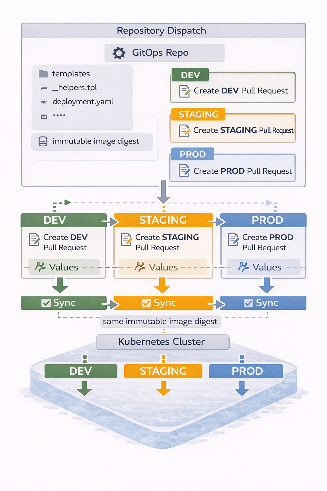
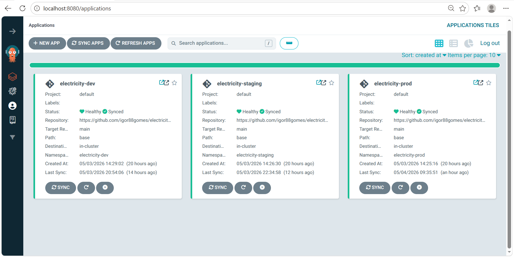
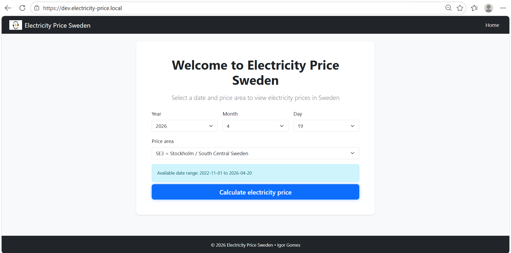
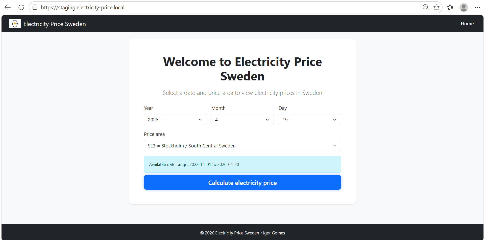
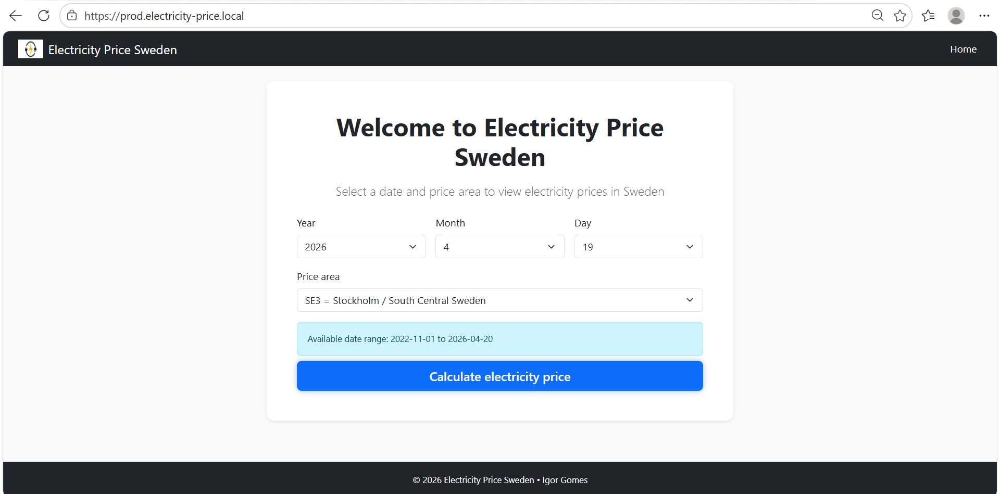
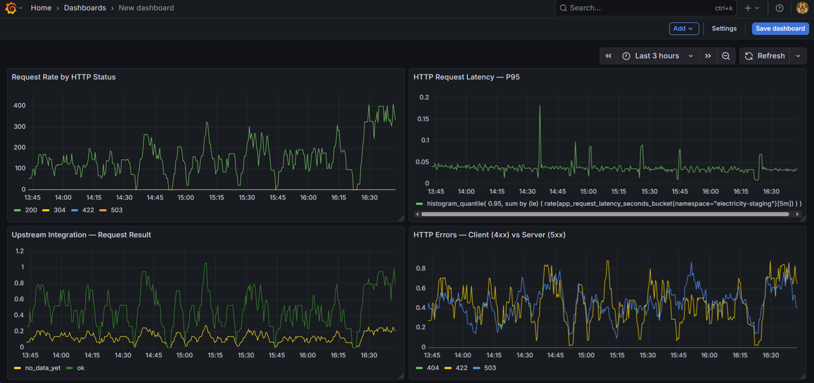
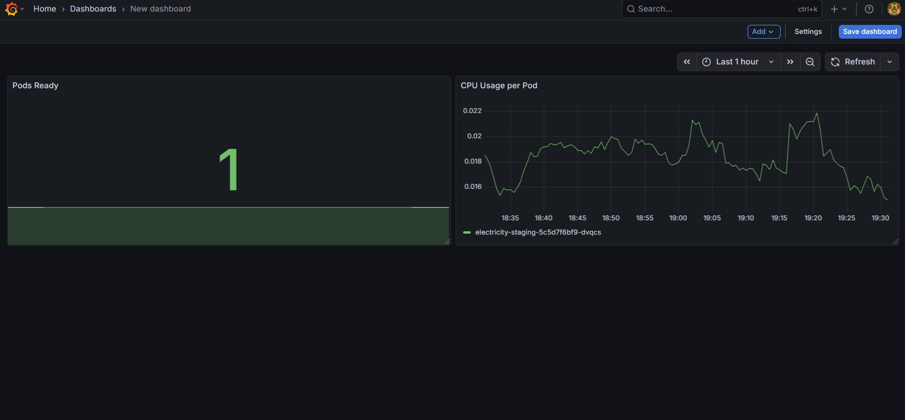
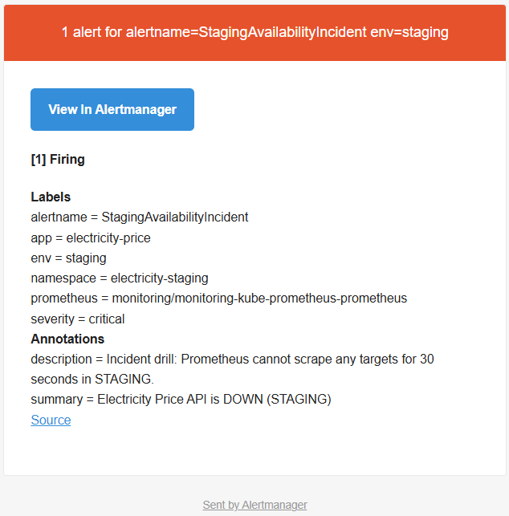
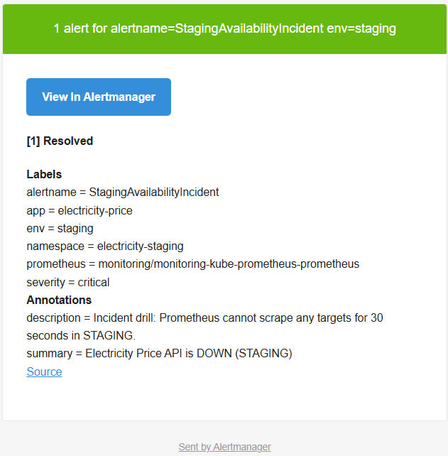

[](https://github.com/igor88gomes/electricity-price-gitops/actions/workflows/gitops-validation.yaml)
[](https://github.com/igor88gomes/electricity-price-gitops/actions/workflows/update-dev.yaml)
[](https://github.com/igor88gomes/electricity-price-gitops/actions/workflows/promotion-handler.yaml)
[](https://github.com/igor88gomes/electricity-price-gitops/actions/workflows/prod-release-handler.yaml)
[](https://github.com/igor88gomes/electricity-price-gitops/actions/workflows/secret-scan.yaml)

🇸🇪 Swedish version:
👉 [Read in Swedish](README.sv.md)

---

> By Igor Gomes  

# Electricity Price Sweden — GitOps Repository

> GitOps repository that manages deployment of the *Electricity Price* application using Helm and Argo CD, in collaboration with the application repository responsible for CI and artifact delivery.

## Overview

### This repository is responsible for
- deployment and environment promotion (DEV → STAGING → PROD)
- runtime configuration and Helm-based deployment
- validation, security and policy enforcement
- observability, dashboards and alerting in Kubernetes
- rollback through declarative GitOps control

### Separate application repository is responsible for
- application code
- tests, lint and coverage
- security scanning
- build and publishing of the container image (artifact)
- triggering deployment to this GitOps repository

> Together, they demonstrate a complete flow from application code and artifact delivery to deployment, observability and environment promotion via GitOps in a Kubernetes cluster.

## Related Repository

**Application (CI & artifact delivery):** [electricity-price](https://github.com/igor-gomes-1/electricity-price)

---

## GitOps Architecture and Promotion Flow

<p align="center">
  
  <br>
  <em>High-level GitOps flow for environment promotion using an immutable image digest.</em>
</p>

## Project Overview

### What
> GitOps repository that defines the desired state for deployment and environment promotion of the
> Electricity Price application in Kubernetes using Helm, which is synchronized and applied
> by Argo CD.

### Why
> To separate application development (CI and artifact delivery) from deployment and
> runtime configuration in a controlled delivery flow.

### Value
> Enables runtime verification of fully built container artifacts across multiple environments.

> The same artifact can be promoted further without rebuild through declarative configuration
> that is continuously synchronized with the cluster.

> The solution includes components such as observability, alerting, policy validation
> and a defined rollback strategy for incident management.

### Scope & Limitations

> This repository does not handle provisioning of Kubernetes clusters,
> networking or underlying infrastructure.

> An existing Kubernetes cluster is assumed, with Argo CD, Helm
> and Prometheus Operator (kube-prometheus-stack) installed.

> Observability and alerting rely on Prometheus-specific CRDs
> (ServiceMonitor, PrometheusRule). Other stacks require adaptation of the manifests.

---

## Tech Stack

| Component                    | Description                                                  |
|------------------------------|--------------------------------------------------------------|
| **Argo CD**                  | GitOps deployment and automated syncs                        |
| **Helm**                     | Templating of Kubernetes manifests                           |
| **Kubernetes**               | Deployment across DEV / STAGING / PROD environments          |
| **GHCR**                     | Container registry for application images                    |
| **kube-prometheus-stack**    | Installs Prometheus, Grafana and Alertmanager                |
| **ServiceMonitor (CRD)**     | Connects the application's `/metrics` to Prometheus scraping |
| **Ingress Controller**       | NGINX-based ingress solution                                 |
| **Policy-as-Code (OPA/Rego)**| Security and compliance rules for Kubernetes manifests       |
| **GitHub Actions**           | Automation for GitOps promotion, validation and governance   |
| **Gitleaks**                 | Secret scanning for manifests and values                     |
 
> The project is demonstrated using a Kubernetes cluster based on Minikube.

## Overall Architecture

In this setup, DEV, STAGING and PROD run in separate namespaces within the same Kubernetes cluster.

This provides logical separation of resources, configuration and deployment flows, while sharing common platform infrastructure and cluster resources.

This design choice is intentional and enables a reproducible and resource-efficient demonstration of the GitOps workflow, with clear environment separation at both application and configuration levels.

> Promotions are initiated by the application repository via `repository_dispatch`. The GitOps repository reacts to `repository_dispatch` events from the application repository by creating Pull Requests per environment, which are applied by Argo CD after merge.

```text
Application repository
(CI: tests, lint, security scanning, build)
    ↓
Artifact CD: Docker publish
(create a single immutable digest)
    ↓
repository_dispatch (promotion event)
    ↓
GitOps repository
    ↓ PR to DEV
      → Merge → Argo CD → Cluster → electricity-dev
    ↓ PR to STAGING
      → Merge → Argo CD → Cluster → electricity-staging
    ↓ PR to PROD
      → Merge → Argo CD → Cluster → electricity-prod
```

### Important

- The image digest is built **once** in the application repository and used as an immutable container artifact.
- The GitOps repository is responsible only for promotion and deployment of existing artifacts.
- Promotion between environments is done via Pull Requests for full traceability and reuses the same image digest (no rebuild).

---

## GitHub Actions – Pipelines

This GitOps repository uses GitHub Actions to manage both **deployment/promotion** and **quality, security and governance** within the GitOps workflow.

### CD – Promotion & Deployment Pipelines

#### `update-dev.yaml`
- Creates a PR to DEV values that references and pins the latest published image digest in the container registry (built in the application repository)
- On auto-merge: Argo CD sync → DEV cluster

#### `promotion-handler.yaml`
- Creates a PR to STAGING values that references and pins the image digest deployed in DEV
- On manual merge: Argo CD sync → STAGING cluster

#### `prod-release-handler.yaml`
- Creates a PR to PROD values that sets the release tag (SemVer) and pins the same image digest that has been promoted through DEV and STAGING
- On manual merge: Argo CD sync → PROD cluster

### Quality, Security & Governance Pipelines

> These pipelines run automatically on changes in the GitOps repository to ensure that only validated and secure manifests are deployed to the cluster.

#### `gitops-validation.yaml`
Runs on Pull Requests to:
- Validate YAML syntax
- Ensure correct structure of Helm manifests
- Validate Policy-as-Code (OPA/Rego) to ensure that application manifests meet platform and security requirements (e.g. TLS, resource limits, non-root)

> Prevents Argo CD from syncing broken or invalid manifests to the cluster.

#### `secret-scan.yaml`
Dedicated pipeline for **secret scanning** in the GitOps repository:
- Runs Gitleaks with custom configuration
- Detects potential credentials and secrets
- Fails the workflow if secrets are detected

> Protects the GitOps repository from accidentally containing sensitive information.

---

## Argo CD Integration

Argo CD is responsible for GitOps synchronization by reading the desired state from Git, using Helm to render manifests, and applying resources to the cluster via the **Kubernetes API** (control plane).

The workflow therefore works both locally in **Minikube** and in other Kubernetes clusters, provided that Argo CD has access to the API server and proper RBAC configuration.

Each environment is represented as a separate Argo CD application and is deployed to its own namespace:

- `electricity-dev`
- `electricity-staging`
- `electricity-prod`

<p align="center">
  
  <br>
<em>Argo CD applications visualizing GitOps-driven promotion across DEV → STAGING → PROD, where environments are updated step by step after merging Pull Requests in the GitOps repository.</em>
</p>

## Helm Rendering and Declarative Deployment

The application is deployed via a Helm chart, where Argo CD renders manifests based on a shared chart (`base/`) combined with environment-specific values files.

The deployment flow is fully declarative and follows GitOps principles.

### Helm Chart – Resources and Functions

| Resource        | Function                                                          |
|-----------------|-------------------------------------------------------------------|
| Deployment      | Runs the application container with liveness and readiness probes |
| Service         | Exposes the application internally within the cluster (ClusterIP) |
| Ingress         | Exposes the application externally per environment                |
| ServiceMonitor  | Enables Prometheus scraping of `/metrics`                         |
| PrometheusRule  | Defines application-specific alerts                               |
| NetworkPolicy   | Restricts network traffic to and from the application             |
| Helm helpers    | Shared naming, labels and annotations via `_helpers.tpl`          |

> **NetworkPolicy:** Only the ingress controller and monitoring components have access to the application by default.  
> For internal testing, the policy can be extended or temporarily disabled per environment.

### Environments

| Environment | Purpose        | URL                                |
|-------------|----------------|------------------------------------|
| DEV         | Initial testing | `dev.electricity-price.local`     |
| STAGING     | Pre-production  | `staging.electricity-price.local` |
| PROD        | Production      | `prod.electricity-price.local`    |

## Application Running in Kubernetes (DEV / STAGING / PROD)

> The application runs in Kubernetes and is active across three separate environments (DEV, STAGING and PROD), each in its own namespace, with traffic managed via environment-specific Ingress resources as a result of the GitOps-driven workflow.

<p align="center">
  
  <br>
  <em>DEV environment: the application runs in Kubernetes in the <code>electricity-dev</code> namespace, deployed via the GitOps workflow.</em>
</p>

<p align="center">
  
  <br>
  <em>STAGING environment: the application runs in Kubernetes in the <code>electricity-staging</code> namespace, deployed via the GitOps workflow.</em>
</p>

<p align="center">
  
  <br>
  <em>PROD environment: the application runs in Kubernetes in the <code>electricity-prod</code> namespace, deployed via the GitOps workflow.</em>
</p>

---

## Rollback Guide (Production Incident)

> Rollback is performed by updating the declarative desired state in the
> GitOps repository to a previously verified container artifact (image
> digest). Argo CD then synchronizes the desired state with the
> Kubernetes cluster without rebuild.

### 1️ Identify the image digest running in PROD

-   In **Argo CD**: open the PROD application and note the current image
    digest

### 2️⃣ Identify a stable release (tag + image digest)

-   In the **application repository**: identify the latest working
    **release (SemVer tag)**
-   In the container registry (GHCR): copy the **image digest**
    associated with that release

> Releases represent versions (SemVer tags) that have passed the full
> flow `DEV → STAGING → PROD` and are considered stable.

### 3️⃣ Update the PROD environment

In the **GitOps repository**, update the PROD environment by setting the
stable image digest in `environments/prod/values.yaml`:

``` yaml
image:
  digest: sha256:<stable-digest>
```

Commit → PR → Merge → Argo CD syncs to the Kubernetes cluster (no rebuild).

**PROD is restored via GitOps synchronization.**
This is a fast and controlled way to stabilize production within this
GitOps workflow.

> Alternatively, a previous Pull Request or commit in the GitOps
> repository can be reverted to a known stable declarative state for a
> quick rollback.

> **Note:**
> This rollback restores a previously stable state.\
> Permanent fixes require code changes and a new image build in the
> application repository.

---

## Observability & Alerting

> All observability and alerting examples are demonstrated in the STAGING environment, which is used for validation before promotion to PROD.

This setup is based on *kube-prometheus-stack*, with Prometheus, Grafana and Alertmanager as core components.

The focus is on a GitOps-driven Kubernetes workflow, with a clearly defined and intentionally scoped implementation.

The observability is divided into:

- **Application-level observability**
- **Kubernetes / platform-level observability**

### Observability Pipeline

```text
Application / Kubernetes
        ↓
Metrics / Signals
        ↓
   Prometheus 
   ↓        ↓
Grafana  Alertmanager
```
### Prometheus – Metrics & Monitoring

The application exposes `/metrics` and is scraped by Prometheus via a ServiceMonitor included in the Helm chart.

This enables:
- Monitoring of the application's health and performance
- Metrics used for visualization in Grafana
- Data used for alerting via PrometheusRule and Alertmanager

### Observability Strategy

| Environment | Observability Scope                               |
|-------------|---------------------------------------------------|
| **DEV**     | Platform-level observability (Kubernetes runtime) |
| **STAGING** | Application-level + platform-level observability  |
| **PROD**    | Application-level + platform-level observability  |

### Application Observability (STAGING)

The dashboard focuses on **Golden Signals** and application health:

- Request rate per HTTP status
- P95 latency for HTTP requests
- Upstream integration results
- Distribution between client errors (4xx) and server errors (5xx)

<p align="center">
  
  <br>
  <em>Grafana dashboard for application observability in the STAGING environment.</em>
</p>

### Kubernetes Runtime Observability (STAGING)

This dashboard focuses on **platform-level observability** and shows how the Kubernetes platform supports the application.

The focus is on **resource status and availability**, independent of the application's own metrics:

- Number of **Pods Ready** in `electricity-staging`
- **CPU usage per pod** over time
- Data for assessing stability and resource behavior

<p align="center">
  
  <br>
  <em>Grafana dashboard for platform-level observability (namespace: electricity-staging).</em>
</p>

---

### Alerting Strategy

Alerting is defined declaratively via **PrometheusRule** and handled by **Alertmanager** as part of the *kube-prometheus-stack*.

The strategy focuses on detecting **critical conditions** that impact application availability and stability, regardless of whether the root cause lies in **application behavior** or the **Kubernetes runtime**.

Examples of critical conditions being monitored:

- the application cannot be scraped by Prometheus
- elevated rate of **HTTP 5xx**
- abnormal latency levels (P95)
- unstable or restarting pods

Alerting is enabled in **STAGING** for validation of rules and notifications, and in **PROD** for actual incident handling in the live environment.

#### Alertmanager – Notifications

Alertmanager is configured to send notifications via **email (SMTP-based notifications)**. The notification logic is defined through a dedicated `AlertmanagerConfig` resource, with credentials securely stored in Kubernetes **Secrets**.

`AlertmanagerConfig` is intentionally kept outside the GitOps repository because it contains environment-specific and security-sensitive runtime configuration. The resource is therefore applied directly in the cluster and is not versioned in Git.

Notifications are sent for both:

- **FIRING** (incident detected)
- **RESOLVED** (incident resolved)

#### E2E Validation of Alerting (STAGING)

Alerting has been verified end-to-end through a controlled availability test, confirming correct handling of both **FIRING** and **RESOLVED** states.

<p align="center" style="max-width:600px; margin: 0 auto 20px auto;">
  
  <em>Alertmanager notification when the Electricity Price application can no longer be scraped by Prometheus.</em>
</p>

<p align="center" style="max-width:600px; margin: 0 auto 28px auto;">
  
  <em>Alertmanager notification when the application becomes available again and at least one scrape target is healthy.</em>
</p>

## Project Structure

```text
electricity-price-gitops/
├── .github/workflows/      # GitHub Actions for GitOps promotion, validation and security
├── argo/                   # Argo CD Application manifests for DEV, STAGING and PROD
├── base/                   # Helm chart defining the application's Kubernetes resources
├── environments/           # Environment-specific Helm values (DEV, STAGING, PROD)
├── policy/                 # Policy-as-Code (OPA/Rego) for validation of Kubernetes manifests
├── docs/                   # Documentation and images used in the README
├── .gitignore              # Ignored files and directories
├── .gitleaks.toml          # Rules for secret scanning (Gitleaks)
├── .yamllint               # YAML linting rules for manifests
├── README.md               # Project overview, architecture, GitOps flow and observability (English)
└── README.sv.md            # Project overview, architecture, GitOps flow and observability (Swedish)
```
---

## Contact

Igor Gomes — DevOps Engineer  
**Email:** [igor88gomes@gmail.com](mailto:igor88gomes@gmail.com)  
**LinkedIn:** [Igor Gomes](https://www.linkedin.com/in/igor-gomes-5b6184290)